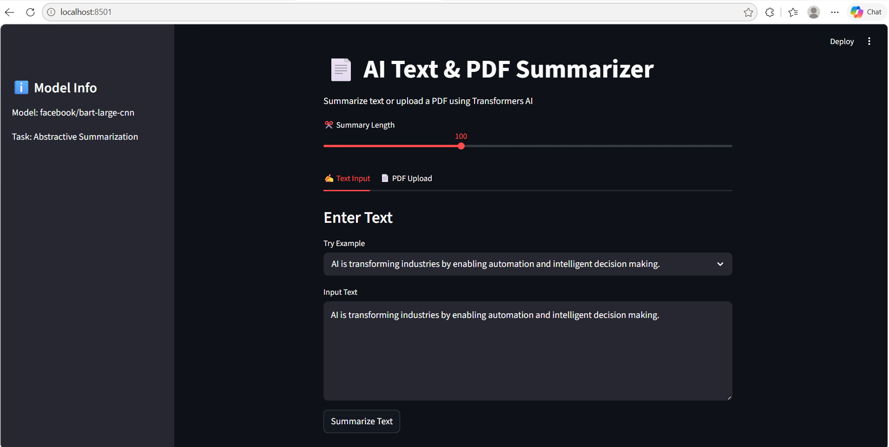
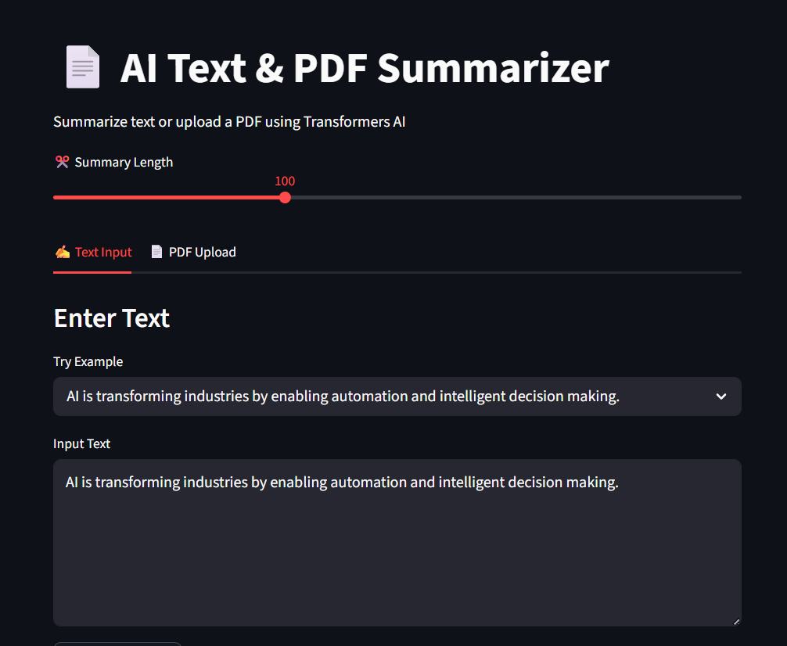
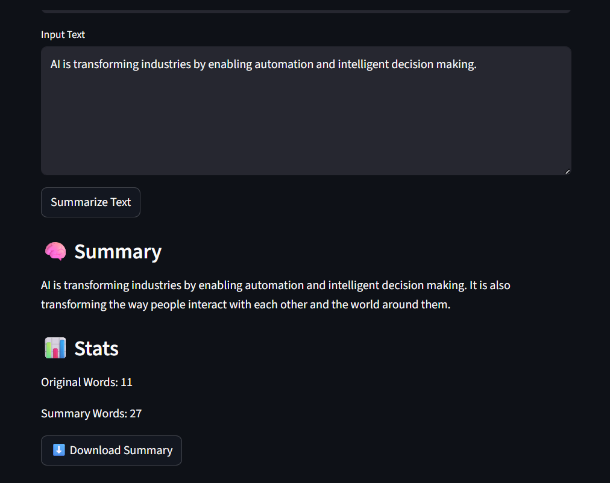
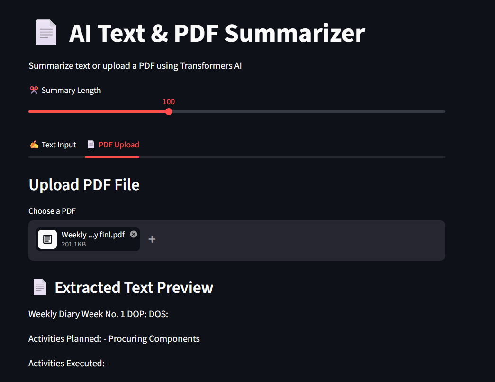
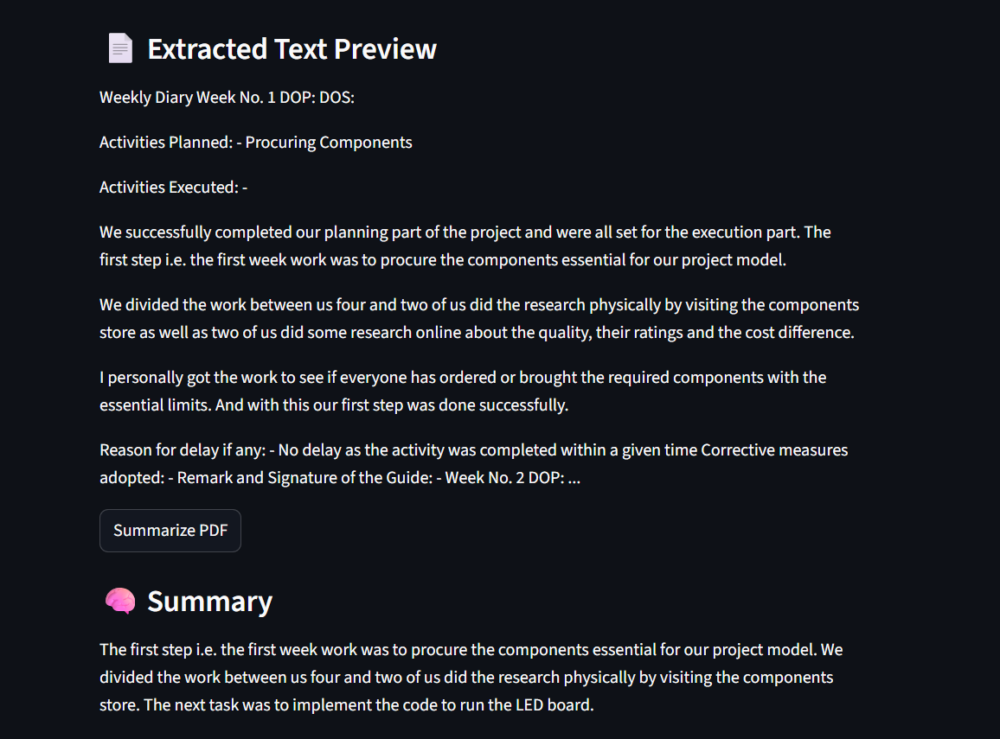
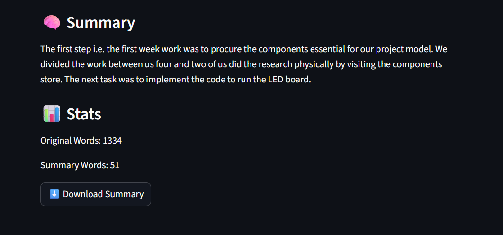

# 📄 AI Text & PDF Summarizer

An AI-powered web application that summarizes long text and PDF documents using HuggingFace Transformers and Streamlit.

---

## 🚀 Overview

This project is a smart summarization tool that extracts key information from long text and PDF files using a pre-trained transformer model. It provides an interactive web interface built with Streamlit.

---

## ✨ Features

- ✍️ Summarize raw text input  
- 📄 Upload and summarize PDF documents  
- 🎚 Adjustable summary length control  
- 📊 Word count statistics (input vs summary)  
- 📥 Download summary as text file  
- 🧠 Example inputs for quick testing  

---

## 🛠️ Tech Stack

- Python 🐍  
- Streamlit 🎈  
- HuggingFace Transformers 🤗  
- PyPDF 📄  

---

## 🤖 Model Used

- `facebook/bart-large-cnn`

---

## 📁 Project Structure
---
📁 text_summarization_project
├── 📄 app.py
├── 📄 requirements.txt
└── 📁 assets
    ├── 🖼️ text_input_ui.png
    ├── 🖼️ pdf_input_ui.png
    ├── 🖼️ text_output_1.png
    ├── 🖼️ text_output_2.png
    ├── 🖼️ pdf_output_1.png
    ├── 🖼️ pdf_output_2.png
    └── 🖼️ pdf_output_3.png

---

## 🌐 Live Demo

👉 https://textsummarizationprojectfinl.streamlit.app/

📸 Demo Screenshots
📝 Text Input UI

📄 PDF Input UI

🧠 Text Output (Result 1)

🧠 Text Output (Result 2)

📄 PDF Output (Result 1)

📄 PDF Output (Result 2)

📄 PDF Output (Result 3)

📊 Use Cases
Summarizing research papers 📚
Quick reading of long PDF notes 📄
Extracting key points from articles 📰
Study material summarization 🎓

💡 Future Improvements
🌐 URL/article summarization
🧾 Export summary as PDF
⚡ Chunk-based long document processing
🌍 Multi-language support

👨‍💻 Author
Anushka Chavare