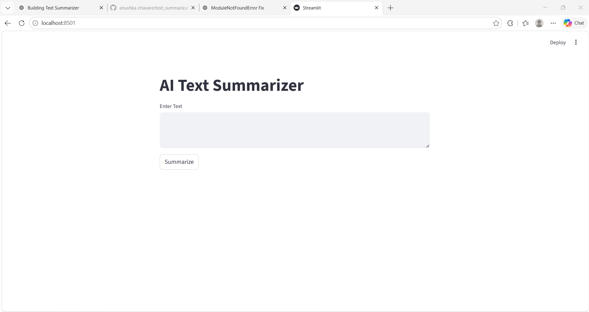
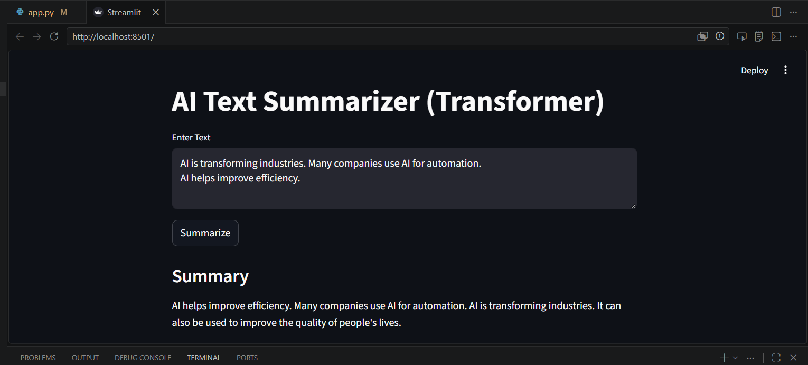
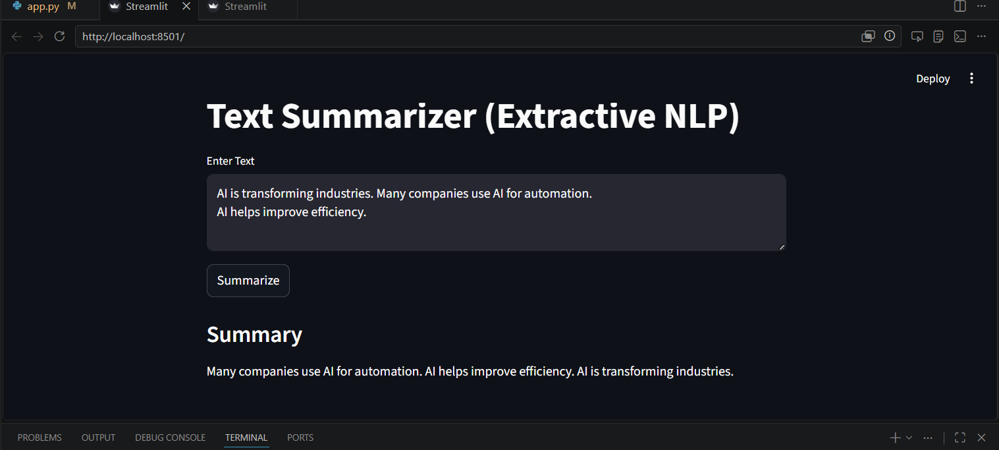

# Text Summarization Project

## Overview
This project summarizes long text into shorter meaningful summaries using NLP techniques.

## Features
- Extractive summarization
- Transformer summarization
- Streamlit UI
- PDF summarization

## Technologies Used
- Python
- NLTK
- Transformers
- Streamlit
- PyPDF2

## Installation

```bash
pip install -r requirements.txt
streamlit run app.py
```


## Screenshots

### User Interface



### Transformer Summary Output



### Before vs After Summarization


